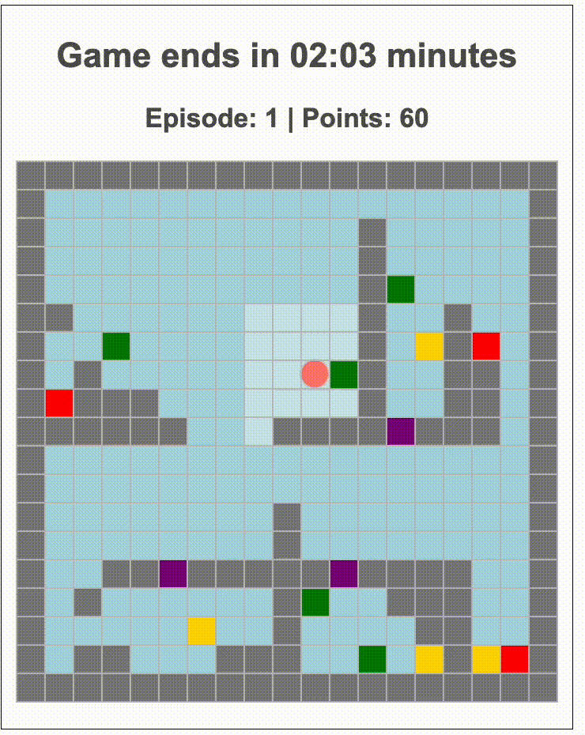
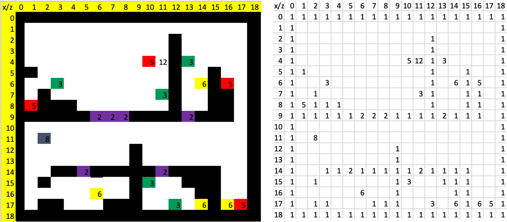
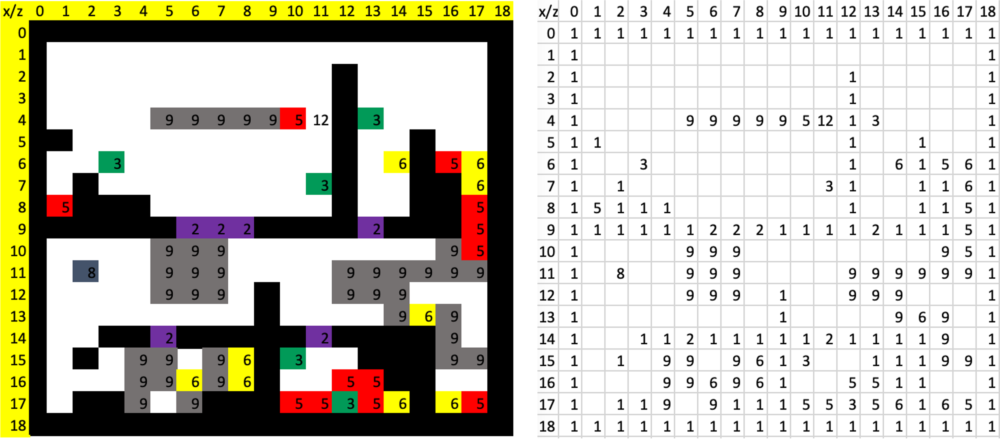
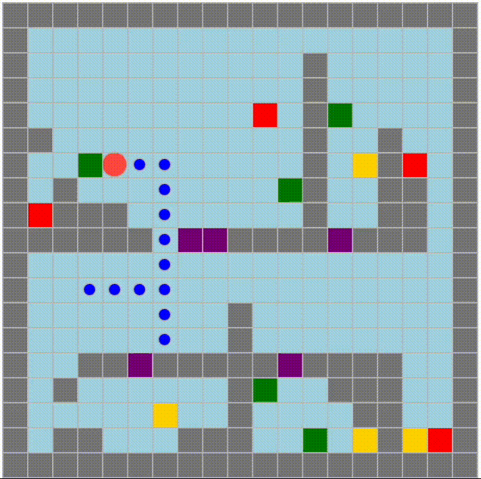

# Minimap: An Interactive Dynamic Decision Making Game for Search and Rescue Missions
This is a browser-based game for Search and Rescue missions. It was written in Python and Javascript and used the FastAPI Python framework to display the interface in a web browser. 

- Navigate the grid: using `Arrow Keys` or `Arrow Keys + X` to speed up the move
- Open a door: pressing the `Enter` key
- Rescue a green victim: pressing the `Enter` key five times
- Rescue a yellow victim: pressing `Enter` ten times

<p align="center">
   
   
   
  <i>Layout the default search and rescue task with different levels of visibility.</i>
</p>

## Requirements:
- To run locally:
    - Python 3.7+ installed
    - A Web browser

## Database
Create a database in MySQL using the SQL script `script.sql`.

## Local Installation
1. In a command shell, go to the main folder that contains the `requirements.txt` file.
2. (suggestion) Create a virtual Python Environment by running the following commands in your shell. (This may be different on your machine! If it does not work, look at how to install a virtual Python env based on your system.):
    - `python3 -m venv env`
    - `source env/bin/activate`
3. Install the required Python libraries by running this command in your shell:
    - `pip install -r requirements.txt`
4. To start the server, run: `python server.py`

# Configuration Overview
Experiment variables are specified in the file `mission/config.json`.

- `cond_name`: condition name
- `load_new_map`: `1` indicates to use of a new task layout in case of creating/modifying a task scenario, and `0` otherwise
- `map_file`: map design file in `CSV` format in case of using the new map layout (`"load_new_map": 1`)
- `map_dir`: directory where all map design files are located
- `tile_width`: value to increase or decrease the size of a task environment
- `game_duration`: variable controlling a gameplay duration (in seconds) within an episode. For a 5-minute game, `"game_duration": 300`
- `max_episode`: value specifying a number of times (episodes) one can play the task. 
- `victim_die`: variable indicating the time (in seconds) when victim disappearance happens. To simulate critical victims disappearing after two minutes elapse, `"victim_die": 120`
- `visibility`: variable controls three levels of visibility, i.e., `fov` (field of view), `map` (map view), and `full` (full view)
- `complexity`: levels of structural complexity used in the study, i.e., `simple` or `complex`
- `delayed_time`: variable specified the delay period (in seconds) for one action to take effect. For immediate actions, `"delayed_time": 0`
- `perturbation_time`: variable indicating when a perturbation or a sudden change within an episode occurs (measured in seconds). For example, during a 5-minute mission, if the perturbation takes place after 2 minutes of gameplay, then `"perturbation_time": 120`
- `map_perturbation`: the design file in `CSV` format associated with the new scenario layout when a perturbation occurs.


# An example of creating a new task scenario with Minimap
A step-by-step walkthrough for creating a task scenario in Minimap.
### Task description
A player needs to navigate the $19 \times 19$ environment to save three types of victims: critical (red) victims, serious (yellow), and minor (green) victims. The player needs to play 10 episodes of a 3-minute game. A perturbation occurs after one minute of the game, which entails the sudden appearance of rubble and an increased number of serious and critical victims. The serious and critical victims vanish when two minutes elapse.

<p align="center">
   <br/>
  <i>New task scenario</i>
</p>


## Step 1: Creating the environment layout
Create a map design file in the Excel configuration and save it in the CSV format (e.g., `map_design_c.csv`). Put the CSV design file in the folder 
`mission/static/`.

<p align="center">
   <br/>
  <i>Illustration of map design Excel and CSV format for the new scenario</i>
</p>

The code number of each object in the environment, together with their associated action and reward, is determined in the following table. 

| Num | Name   | Press | Reward |
|:---:|--------|-------|--------|
|  1  | wall   | 0     | 0      |
|  2  | door   | 1     | 0      |
|  3  | green  | 5     | 10     |
|  4  | blue   | 15    | 10     |
|  5  | red    | 20    | 60     |
|  6  | yellow | 10    | 30     |
|  7  | other  | 0     | 0      |
|  8  | agent  | 0     | 0      |
|  9  | rubble | 5     | 0      |

The reward for obtaining each object and the number of keystrokes required for such action is defined in the column `Press` and `Reward`. For instance, to adjust the value of saving the green object to 12 points (instead of 10 points) and the number of key presses needed is 7, change the third row in the table as follows:

| Num | Name   | Press | Reward |
|:---:|--------|-------|--------|
|  3  | green  | 7     | 12     |

## Step 2: Adding perturbations
To simulate a sudden change in the environment within a game, design a new setting when the perturbation happens in the Excel file. Save the design file in the CSV format (e.g., `map_perturbation_c.csv`) and place it in the folder `mission/static/`.

<p align="center">
   <br/>
  <i>Illustration of map design Excel and CSV format for the new setting after the perturbation</i>
</p>

## Step 3: Configurating experiment parameters
Adjust the file `mission/config.json` as the following
```
    "load_new_map": 1,
    "map_file": "map_design_c.csv",
    "map_dir": "mission/static/data/",
    "tile_width": 20,
    "game_duration": 180,
    "max_episode": 10,
    "victim_die": 120,
    "visibility": "full",
    "delayed_time": 1000,
    "perturbation_time": 60,
    "map_perturbation": "map_perturbation_c.csv"
```

## Step 4: Running the task
Start the server by typing:
```
python server.py
```

Once the server is started, launch the new task scenario by connecting to:
```
http://0.0.0.0:5700/minimap?uid=XX
```
## Step 5:

Replay the recorded data files by entering:

```
http://0.0.0.0:5700/replay
```

Then select the data file to display the playback:

<p align="center">
   <br/>
  <i>Illustration of the replay function with the new task scenario</i>
</p>

## Further Issues and questions
If you have issues or questions, don't hesitate to contact [Ngoc Nguyen](https://ngocntkt.github.io) at ngocnt@cmu.edu.
